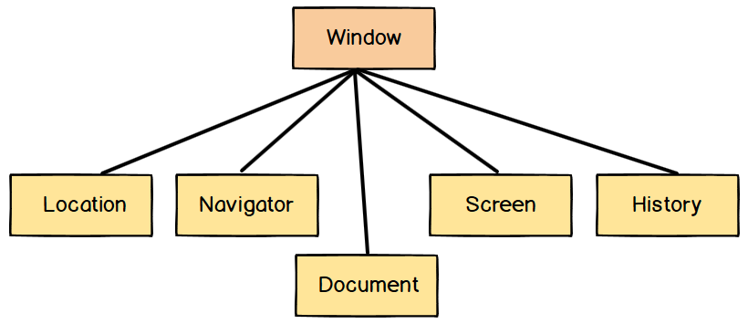
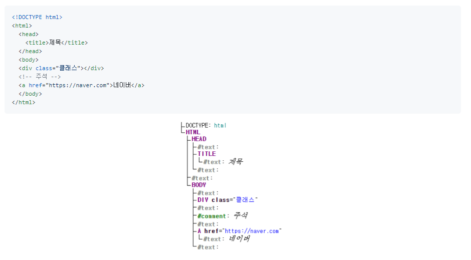

# BOM과 DOM

## BOM

> Browser Object Model
>
> 브라우저의 창이나 프레임을 프로그래밍적으로 제어할 수 있게 해주는 객체 모델

브라우저의 새 창을 열거나 다른 문서로 이동하는 등의 기능을 실행시킬 수 있다. 전역객체로 `window` 가 있으며 하위 객체들로 location, navigation, document, screenm history 가 포함되어 있다.

 

## DOM

> Document Object Model, 
>
> 웹페이지를 프로그래밍적으로 제어할 수 있게 해주는 문서 객체 모델

최상위 인터페이스로 Node가 있으며 아래와 같은 구조로 나타난다.

HTML/XML 문서는 브라우저에서 DOM트리로 표현됩니다. (텍스트와 주석까지도 모두 하나의 노드로써 DOM트리에 포함됩니다.)

- 자동교정 Autocorrection

  브라우저는 잘못된 HTML을 만나게 되면 자동으로 DOM을 생성하여 바로잡습니다.

- \<tbody>

  html 마크업을 할 때, `table` 태그를 작성하면 브라우저는 자동으로 `tbody` 태그를 만듭니다.