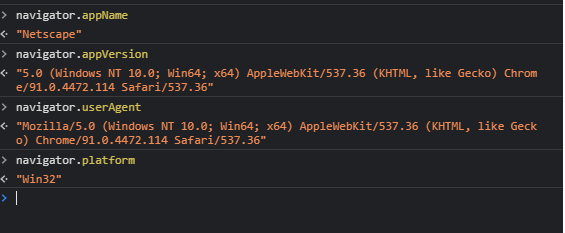
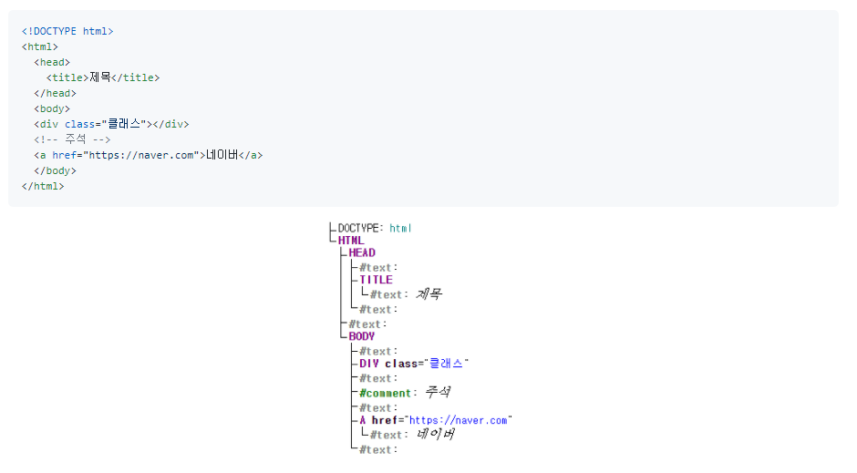

# BOM과 DOM

## BOM

> Browser Object Model
>
> 브라우저의 창이나 프레임을 프로그래밍적으로 제어할 수 있게 해주는 객체 모델

브라우저의 새 창을 열거나 다른 문서로 이동하는 등의 기능을 실행시킬 수 있다. 전역객체로 `window` 가 있으며 하위 객체들로 location, navigation, document, screen, history 가 포함되어 있다.

### 각각의 기능들

- Location 객체

  - 문서의 주소와 관련된 객체로 Window 객체의 프로퍼티이디ㅏ. 이 객체를 이용해서 윈도우의 문서 url을 변경할 수 있고, 문서의 위치와 관련해서 다양한 정보를 얻을 수 있다. 
  - `location.href` , `location.toString()`을 통해 현재 URL을 알 수 있다.

- Navigator 

  - 브라우저의 정보를 제공하는 객체이다. 주로 호환성 문제들을 위해서 사용한다.

    

- Screen 
  - 모니터 화면 정보에 대한 객체이다.
  - 화면 구성에 대해 조정할 때 사용한다.
- History
  - 페이지가 이동한 정보를 관리하는 객체이다.
  - 현재 페이지에서 이전페이지, 이후 페이지 등으로 이동할 수 있다.
  - `back()`, `forward()`, `go(n) : n만큼 이동 - 음수이면 이전페이지` 

 

## DOM

> Document Object Model, 
>
> 웹페이지를 프로그래밍적으로 제어할 수 있게 해주는 문서 객체 모델

최상위 인터페이스로 Node가 있으며 아래와 같은 구조로 나타난다.

HTML/XML 문서는 브라우저에서 DOM트리로 표현됩니다. (텍스트와 주석까지도 모두 하나의 노드로써 DOM트리에 포함됩니다.)

- 자동교정 Autocorrection

  브라우저는 잘못된 HTML을 만나게 되면 자동으로 DOM을 생성하여 바로잡습니다.

- \<tbody>

  html 마크업을 할 때, `<table>` 태그를 작성하면 브라우저는 자동으로 `tbody` 태그를 만듭니다.

  

