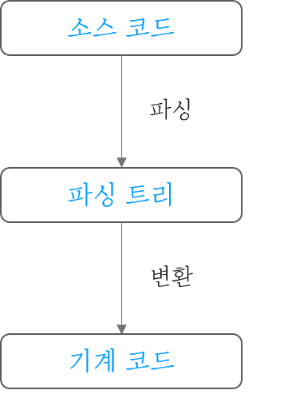

## 브라우저 동작원리

🌱: 이해 못 한 부분


#### 학습 목표: 브라우저가 어떤 과정을 거쳐서 어떻게 화면에 보이게 되는지 원리를 파악하는 것이 목표


### 브라우저의 주요 기능

"사용자가 선택한 자원을 서버에 요청하고 브라우저에 표시하는 것"

- 자원: URI(Uniform Resource Identifier)을 통해 가져와지는 어떠한 형태(주로 HTML)

HTML과 CSS 명세에 따라 HTML 파일을 해석해서 표시

- 명세의 표준화 - W3C(World Wide Web Consortium, 웹 표준화 기구)

<br>

브라우저의 사용자 인터페이스의 일반적 요소

- URI를 입력할 수 있는 주소 표시줄
- 이전 버튼과 다음 버튼
- 북마크
- 새로 고침 버튼과 현재 문서의 로드를 중단할 수 있는 정지 버튼
- 홈 버튼


<br>

*HTML5 명세는 주소 표시줄, 상태 표시줄, 도구 모음과 같은 일반적인 요소를 제외하고는 브라우저의 필수 UI 정의 하지 않고 있다*


<br>

### 브라우저의 기본 구조


<center>브라우저의 주요 구성 요소</center>


<br>

1. 사용자 인터페이스: 요청한 페이지를 보여주는 창을 제외한 나머지 부분
   - example) 주소 표시줄, 이전/다음 버튼, 북마크 메뉴 등
2. 브라우저 엔진: 사용자 인터페이스와 렌더링 엔진 사이의 동작을 제어
3. 렌더링 엔진: 요청한 콘텐츠를 표시(화면에 나타내는 역할)
   - example) HTML을 요청하면 HTML과 CSS를 파싱하여 화면에 표시
4. 통신: HTTP 요청과 같은 네트워크 호출에 사용(플랫폼 독립적 인터페이스, 플랫폼 하부에서 실행)
5. 자바스크립트 해석기: 자바스크립트 코드를 해석하고 실행
6. UI 백엔드: 플랫폼에서 명시하지 않은 일반적인 인터페이스로 콤보 박스와 창 같은 기본적인 장치를 그림(OS 사용자 인터페이스 체계를 사용)
7. 자료 저장소: 자료 저장 계층(쿠키 저장과 같이 모든 종류의 자원을 하드 디스크에 저장할 필요)


<br>

*크롬은 각 탭별로 별도의 렌더링 엔진 인스턴스를 유지(독립된 프로세스로 처리)*


<br>

### 렌더링 엔진

- 파이어 폭스: Gecko
- 사파리, 크롬: Webkit

<br>

### 동작 과정

통신으로부터 요청한 문서의 내용을 얻는 것이 **Start**(보통 8KB 단위로 전송)

<br>


<center>렌더링 엔진의 기본 동작 과정</center>

<br>

##### ~렌더 트리 구축

렌더링 엔진은 HTML 문서를 파싱하고 "콘텐츠 트리"내부에서 태그를 DOM 노드로 변환

- 콘텐츠 트리: 부모-자식 구조로 콘텐츠들을 분류해놓은 트리
- DOM(Document Object Model): 문서 객체 모델, HTML, XML 문서의 프로그래밍 인터페이스

외부 CSS 파일(CSSOM)과 함께 포함된 스타일 요소 파싱

렌더 트리 생성

- 렌더 트리: 최종적으로 화면에 보여줄 부분들을 담고 있는 트리

<br>

##### ~렌더 트리 배치

각 화면에 정확한 위치에 노드 표시

<br>

##### ~ 렌더 트리 그리기

UI 백엔드에서 렌더 트리 노드를 통해 그리기

<br>

*렌더링 엔진은 모든 HTML을 파싱할 때까지 기다리지 않고 배치와 그리기 과정 진행*

*나머지 전송 대기와 동시에 받은 내용 일부 화면 표시*

<br>

#### 동작 과정 예시(자세히)

<br>


<center>웹킷 동작 과정</center>


<br>


<center>게코 동작 과정</center>


<br>


*용어의 차이가 있으나 기본적으로 동작 과정은 비슷함을 알 수 있다*

<br>


### 파싱과 DOM 트리 구축

문서 파싱은 브라우저가 코드를 이해하고 사용할 수 있는 구조로 변환하는 것을 의미

일반적으로 문서 구조를 나타내는 노드 트리(parse tree(파싱 트리) or syntax tree(문법 트리))


<br>


<center>`1+2=3` 표현식의 트리 예시 모습</center>


<br>

*파싱은 문서에 작성된 언어 또는 형식의 규칙에 따르기 때문에 파싱하려는 모든 형식은 정해진 용어와 구문 규칙에 따라야 한다* - [문맥 자유 문법](https://ko.wikipedia.org/wiki/%EB%AC%B8%EB%A7%A5_%EC%9E%90%EC%9C%A0_%EB%AC%B8%EB%B2%95)

🌱 문맥 자유 문법 찾아보기

<br>


#### 파싱 과정(내부적 작동)

파싱은 <u>어휘 분석</u>과 <u>구문 분석</u> 두 가지로 구분 가능

- 어휘 분석: 자료를 토큰화하는 과정
- 구문 분석: 구문 규칙 적용 과정

<br>


<center>문서로 부터 파싱 트리를 만드는 과정</center>

<br>

어휘 분석기는 공백과 줄 바꿈 등의 의미 없는 문자 제거

파서는 언어 구문 규칙에 따라 문서 구조를 분석해서 파싱 트리를 생성

<br>


#### 변환

파싱은 문서를 다른 양식으로 변환(대표적으로 컴파일)

<br>




<br>


##### 참고

- 어휘: 보통 [정규 표현식](http://www.regular-expressions.info/)으로 표현
- 구문: 보통 [BNF(배커스-나우르 표기법, Backus-Naur form)](https://ko.wikipedia.org/wiki/%EB%B0%B0%EC%BB%A4%EC%8A%A4-%EB%82%98%EC%9A%B0%EB%A5%B4_%ED%91%9C%EA%B8%B0%EB%B2%95) 형식으로 정의

<br>

#### 파서의 종류

- 하향식 파서: 상위 구조에서 시작
- 상향식 파서: 낮은 수준에서 높은 수준으로, 이동-감소 파서라고 부르기도 한다(입력값의 오른쪽으로 이동하면서 남는 것이 감소하기 때문에)

<br>

#### HTML 파서

HTML 마크업을 파싱 트리로 변환

<br>

#### HTML 문법 정의

HTML의 어휘와 문법은 W3C에 의해 명세로 정의

HTML 정의는 DTD(문서 형식 정의): **문맥 자유 문법이 아니다**(전통적 파서(BNF 형식을 이용하는)를 사용할 수 없다)

- DTD(Document Type Definition, 문서 형식 정의): SGML 계열의 마크업 언어에서 문서 형식을 정의
  - SGML(Standard Generalized Markup Language): 문서용 마크업 언어를 정의하기 위한 메타 언어

- XML 파서는 사용할 수 있는데 HTML은 왜 되지 않을까?

  > HTML은 암묵적인 태그 생략 등 <u>유연한</u> 특성을 가지고 있기 때문

<br>

#### DOM

**파싱 트리**는 DOM 요소와 속성 노드의 트리로서 출력 트리가 된다

HTML 문서의 객체 표현이고 외부를 향하는 자바스크립트와 같은 HTML 요소의 **연결지점**

트리의 최상위 객체는 문서(Document)


예제 마크업

```html
<html>
    <body>
        <p>Hello World</p>
        <div></div>
    </body>
</html>
```

<br>


<center>예제 마크업의 DOM 트리</center>


<br>


#### 🌱파싱 알고리즘(추후 정리)

HTML은 일반적인 하향식 상향식 파서를 사용할 수 없다. 왜냐하면

1. 언어의 너그러운 속성

2. 일반적인 HTML 오류에 대한 브라우저의 관용

3. 🌱변경에 의한 재파싱

   예를 들면 `document.write` 스크립트 태그의 경우 토큰 추가 가능성 - 실제로 입력 과정에서 파싱이 수정될 수 있다

<br>

∴ (브라우저는) HTML 파싱을 위해 별도의 파서 생성

[파싱 알고리즘 자세한 설명](https://html.spec.whatwg.org/multipage/parsing.html)

<br>

#### 🌱브라우저의 오류처리(추후 정리)

<br>

#### 🌱CSS 파싱

 CSS는 문맥 자유 문법이기 때문에 전통적 파서 사용 가능

CSS 명세는 CSS 1. 어휘와 2. 구문을 정의하고 있다

<br>

어휘 문법 예시

```
omment   \/*[^]*+([^/][^]*+)\/
num        [0-9]+|[0-9]"."[0-9]+
nonascii    [\200-\377]
nmstart    [_a-z]|{nonascii}|{escape}
nmchar    [_a-z0-9-]|{nonascii}|{escape}
name        {nmchar}+
ident        {nmstart}{nmchar}
```

<br>

구문 문법 예시(BNF로 설명)

```
Ruleset  
   : selector [ ',' S* selector ]*
       '{' S* declaration [ ';' S* declaration ]* '}' S*
   ;
Selector  
   : simple_selector [ combinator selector | S+ [ combinator? selector ]? ]?
   ;
simple_selector  
   : element_name [ HASH | class | attrib | pseudo ]*
   | [ HASH | class | attrib | pseudo ]+
   ;
Class  
   : '.' IDENT
   ;
element_name  
   : IDENT | '*'
   ;
Attrib  
   : '[' S* IDENT S* [ [ '=' | INCLUDES | DASHMATCH ] S*
       [ IDENT | STRING ] S* ] ']'
   ;
Pseudo  
   : ':' [ IDENT | FUNCTION S* [IDENT S*] ')' ]
   ;
```

<br>

`Ruleset`을 좀 더 자세히 살펴보면

```
Ruleset  
   : selector [ ',' S* selector ]*
       '{' S* declaration [ ';' S* declaration ]* '}' S*
   ;
```

1. `,`와 공백(S가 공백 의미)으로 구분된 하나 또는 여러 개의 선택자
2. 중괄호 내부에 하나 또는 `;`으로 구분된 여러 개의 선언 포함

<br>

#### CSS 파서

웹킷 CSS 파서: 플렉스와 바이슨 파서 생성기(상향식 이동 감소 파서)

파이어폭스: (직접 작성한) 하향식 파서

<br>

```css
p, div {
    margin-top: 3px;
}
.error {
    color: red;
}
```


<center>예시 코드 CSS 파싱</center>

<br>

CSS 파일 → 스타일 시트 객체 → (각 객체는) CSS 규칙 객체 포함 → 선택자, 선언 객체, (CSS 문법과 일치하는 다른 객체 포함)

<br>

### 🌱스크립트와 스타일 시트의 진행순서

#### 스크립트

웹은 파싱과 실행이 동시에 수행되는 동기화 모델

**스크립트가 실행되는 동안 문서의 파싱은 중단**

단, 제작자가 스크립트를 `defer`(지연) 표시하면 문서 파싱 중단되지 않고 문서 파싱 완료 후 스크립트 실행

🌱HTML5는 스크립트를 비동기로 처리하는 속성을 추가했기 때문에 별도의 맥락에 의해 파싱되고 실행된다

<br>

#### 🌱예측 파싱

스크립트 실행 간 다른 스레드는 자원을 찾아 받고 문서의 나머지 부분 파싱

자원의 병렬 연결과 속도 개선 가능

단, 외부 스크립트, 외부 스타일 시트, 외부 이미지 등 참조된 외부 자원 파싱

<br>

#### 스타일 시트

이론 상 스타일 시트는 DOM 트리를 변경하지 않기 때문에 문서 파싱을 기다리거나 중단할 이유가 없음

하지만, **스크립트가 스타일 정보를 요청하면 잘못된 결과 가능**

- 파이어폭스: 로드 or 파싱 중인 스타일 시트가 있으면 스크립트 실행 중단
- 🌱(판단 어떻게?)웹킷: 로드되지 않은 스타일 시트 가운데 문제가 될 속성이 있으면 스크립트 중단

<br>

### 렌더 트리 구축

DOM 트리가 구축되는 동안 브라우저는 렌더 트리를 구축

표시 순서와 문서의 시각적인 구성 요소의 올바른 순서로 내용을 그려내기 위함

- 파이어 폭스: 형상(frames)

- 웹킷: 렌더 객체(render object) or 렌더러(renderer)

<br>

웹킷 렌더러

- 자신과 자식 요소를 어떻게 배치하고 그려내야 하는지 알고 있다
- CSS 명세에 따라 노드의 CSS 박스에 부합하는 사각형을 표시(너비, 높이, 위치 같은 기하학 정보 포함)

<br>

### DOM 트리와 렌더 트리의 관계

- 렌더러는 DOM 요소에 부합하지만 1:1로 대응하는 관계는 아님

  (example) 

  - `head`: 렌더 트리에 추가 X(비시각적 DOM 요소)
  - `display: none;`(단, `hidden`은 렌더 트리에 나타난다)
  - `select`: 하나의 사각형으로 묘사할 수 없는 복잡한 구조(표시, 드롭다운 목록, 버튼 - 3개의 렌더러 존재)
  - `float`, `absolute`: 위치와 다른 곳에 배치(자리 표시자가 원래의 위치에 배치되어 정보를 알려줌)


### 🌱트리를 구축하는 과정

### 🌱스타일 계산


<br>

### 참고 자료

[Naver D2, 브라우저는 어떻게 동작하는가?](https://d2.naver.com/helloworld/59361)

